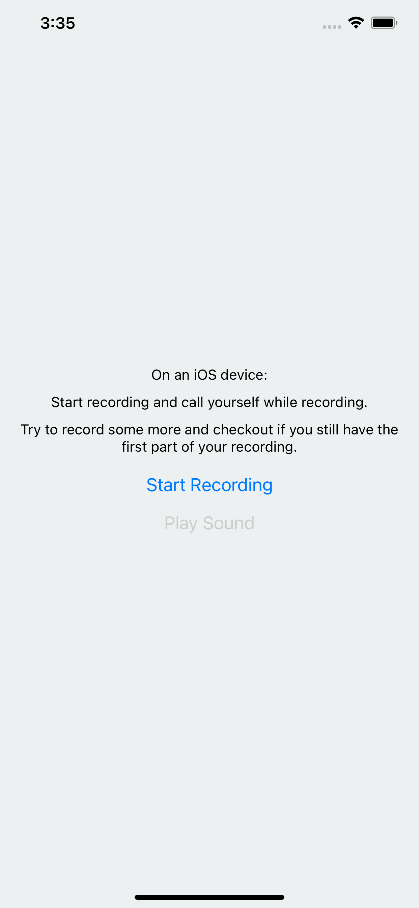

# Expo iOS Bug: When receiving a call, automatically resets the current recording

## Expected behaviour

- Start recording
- Receive phone call (the phone call pauses the recording)
- Resume recording (the recording resumes from where it was paused)

## Actual behaviour

- Start recording
- Receive phone call (the phone call pauses the recording & reset the durationMillis to 0)
- When resuming the recording, what was recorded before the phone call is ereased.

## The MVP

Starter, example from the documentation: https://docs.expo.dev/versions/latest/sdk/audio/#recording-sounds

### Install

`npm i`

### Run

`npm run start`
